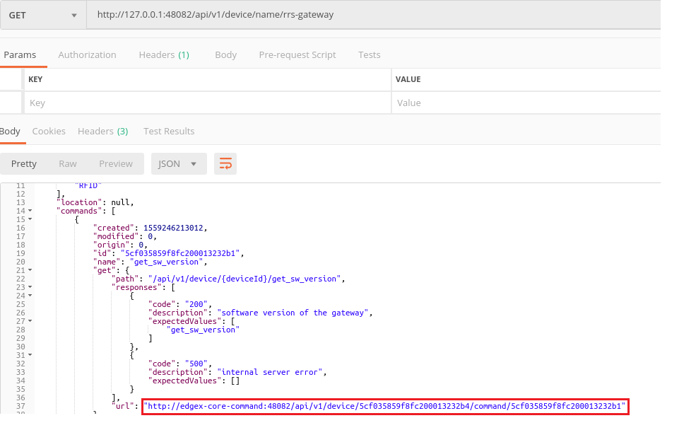
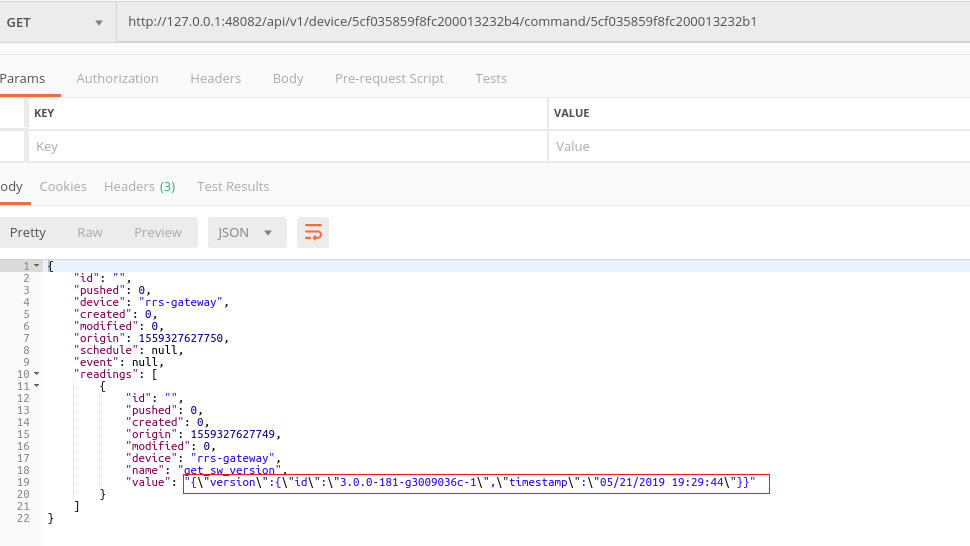

## Sending Commands to gateway
To send commands from Edgex to gateway we need some client such as POSTMAN[https://www.getpostman.com/]. The commands 
that can be sent are:
 
 1. get_sw_version used to get software version of the gateway
 2. get_sensor_info used to get information of sensors connected to the gateway.
 
Open POSTMAN or any similar tool and execute the following apis:

- Replace `host (127.0.0.1)` in the below api with the respective server IP address or use the same if running on 
localhost
```
GET to http://127.0.0.1:48082/api/v1/device/name/rrs-gateway
```
- A json response is received if the GET request is successful. Response consists information of the 
device (rrs-gateway) from which url to send commands needs to be copied - url highlighted in red below is used to send
command to get software version of the gateway (get_sw_version)



- The command copied should be modified to match the server ip address or localhost (127.0.0.1). If the GET call is
successful a json response can be seen from which the desired value can be extracted. The response can
be a success or an error sent by the gateway both of which can be found in the "value" field (highlighted in red below)

